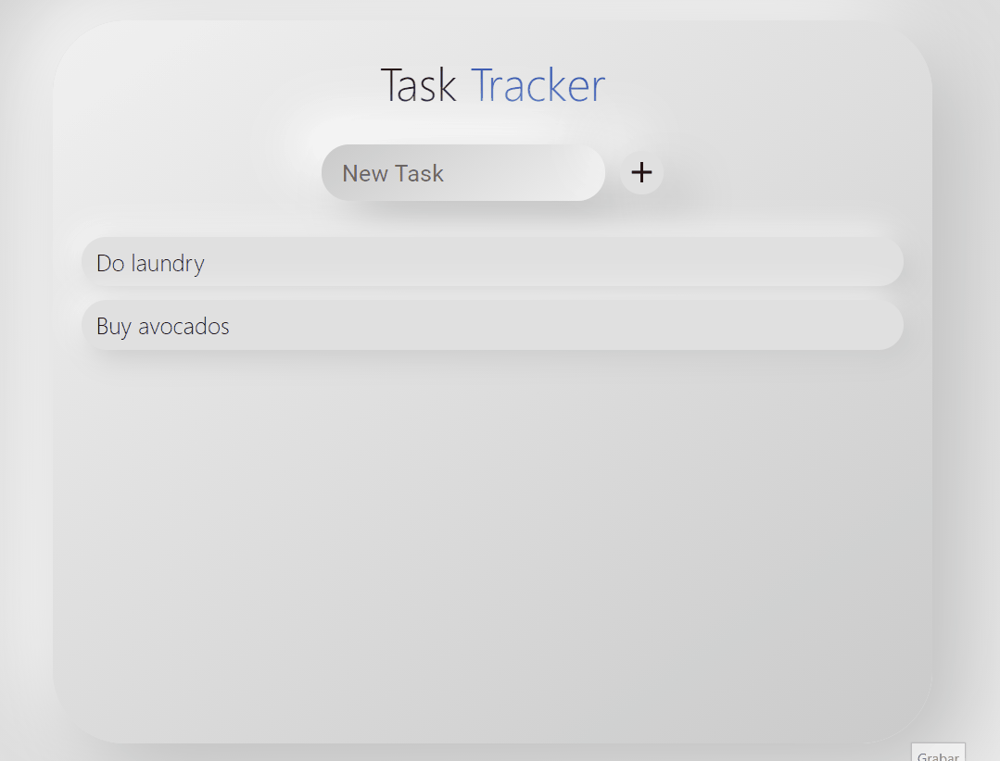

# TodoList with React Hooks

Responsive Todo List.

This project has been made using React Hooks, [Material UI React Framework](https://material-ui.com/) and inspired in neuromorphism UI/UX (for what I have used [this wonderfull tool](https://neumorphism.io/)).

## Demo gif

